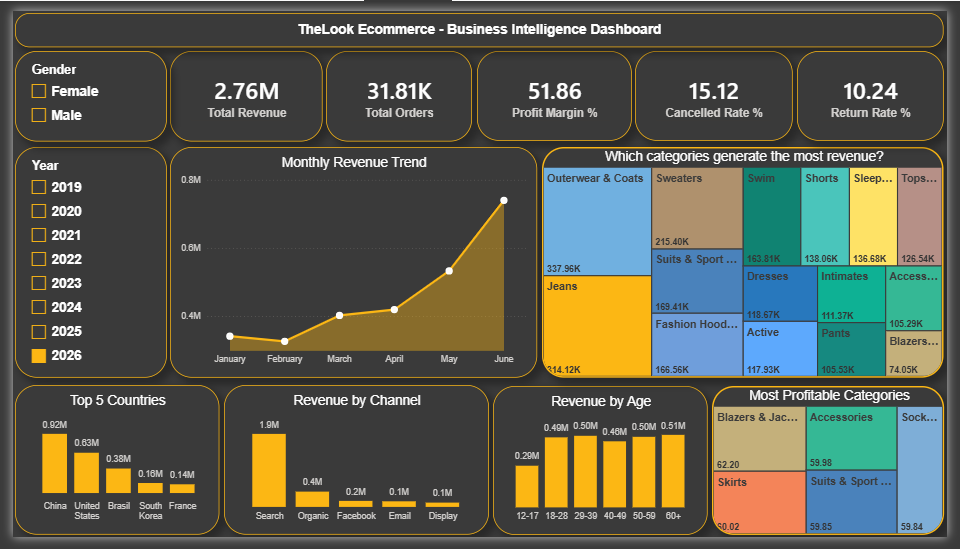

# TheLook Ecommerce — SQL & Power BI

SQL analysis of a global fashion ecommerce store using Google BigQuery, visualized in Power BI.

## Files
- `DATA EXPLORATION.sql` — row counts, null checks, duplicate checks
- `DATA ANALYSIS.sql` — 8 business insight queries
- `Dashboard.png` — Power BI dashboard screenshot

## Dataset
**Source:** Google BigQuery Public Data — `bigquery-public-data.thelook_ecommerce`

| Table | Rows |
|---|---|
| orders | 125k+ |
| order_items | 181k+ |
| products | 29k+ |
| users | 100k |

## Business Questions Answered
1. Is revenue growing month over month?
2. Which products generate the most revenue?
3. Which categories have the highest profit margin?
4. What percentage of orders are cancelled or returned?
5. Which countries generate the most revenue?
6. Which marketing channel drives the most revenue?
7. Which customer age group spends the most?

## SQL Skills Used
JOINs · CTEs · Window Functions · CASE WHEN · Aggregate Functions · GROUP BY

## Dashboard

[View on Google Drive](https://drive.google.com/drive/folders/1uaCvZnnfB8ZIu-9xPcC3c7-zOqqk12zW?usp=sharing)