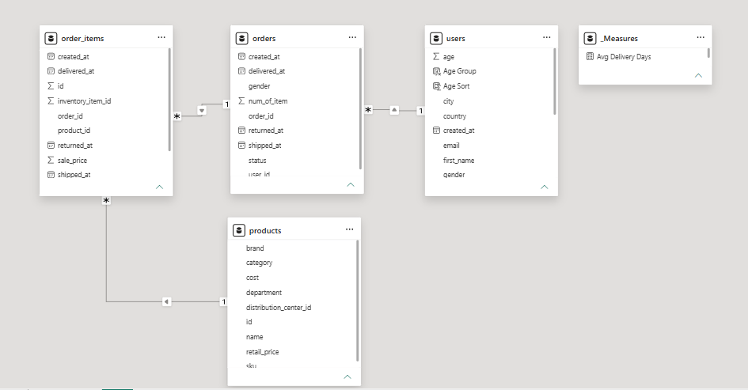
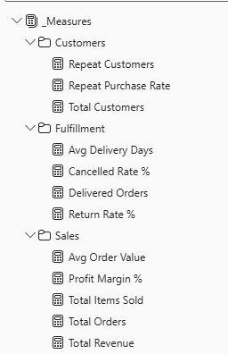
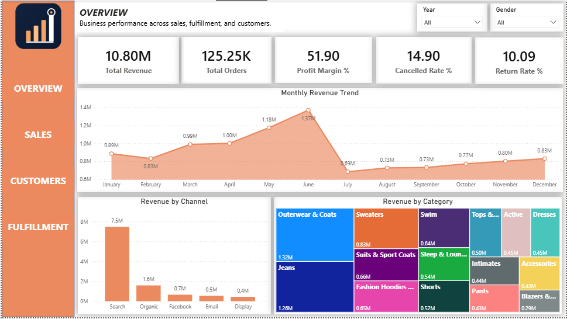
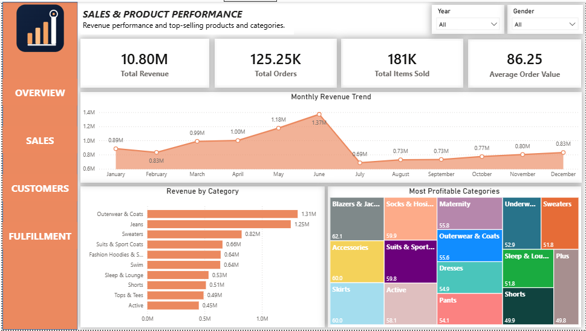
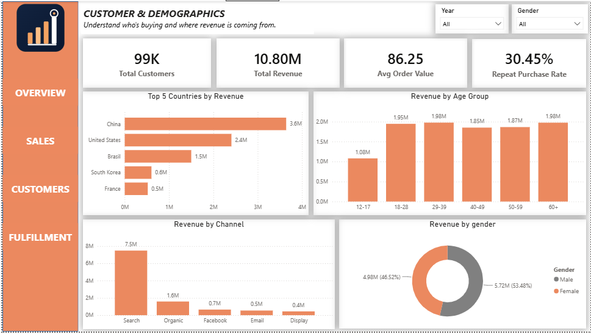
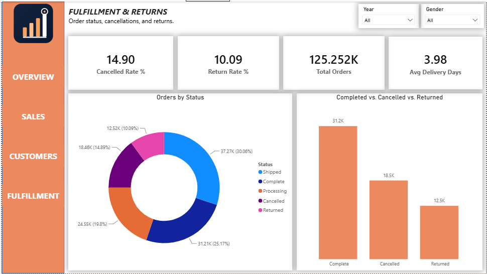

# TheLook Ecommerce — SQL & Power BI Dashboard

A four-page Power BI dashboard and SQL analysis built on Google BigQuery's public `thelook_ecommerce` dataset (125K+ orders, 100K+ users), answering key business questions on revenue, profitability, fulfillment, and customer behavior.

[View on Google Drive](https://drive.google.com/drive/folders/1uaCvZnnfB8ZIu-9xPcC3c7-zOqqk12zW?usp=sharing)
---

## Project Overview

TheLook Ecommerce is a synthetic but realistic e-commerce dataset maintained by Google, covering orders, order line items, products, and users across a global customer base. This project explores the dataset in two stages:

1. **SQL exploration & business-question analysis** directly in BigQuery
2. **A four-page Power BI dashboard** (Overview, Sales & Product Performance, Customer & Demographics, Fulfillment & Returns) built on top of the same data, with a star-schema model and 12 DAX measures

---

## Source Data

Dataset: [`bigquery-public-data.thelook_ecommerce`](https://console.cloud.google.com/marketplace/product/bigquery-public-data/thelook-ecommerce)

Tables used:

| Table | Row Count | Role |
|---|---|---|
| `orders` | 125,665 | Order-level status, dates |
| `order_items` | 181,839 | Line-item revenue, links order ↔ product |
| `products` | 29,120 | Product catalog, cost, category |
| `users` | 100,000 | Customer demographics, acquisition channel |

Date range: 2019-01-06 to present — this is a **live dataset**, continuously updated by Google, not a static snapshot.

---

## Data Exploration & Cleaning (SQL)

Before modeling, the four core tables were profiled directly in BigQuery:

- **Row counts** confirmed above via `COUNT(*)` on each table.
- **Status values** — both `orders.status` and `order_items.status` use the same 5 values: `Complete`, `Processing`, `Shipped`, `Cancelled`, `Returned`. Nulls in `shipped_at`, `delivered_at`, and `returned_at` are expected (order hasn't reached that stage yet) — not a data quality issue.
- **Category values** — 26 distinct product categories, no cleanup needed.
- **Traffic sources** — 5 channels: `Search`, `Organic`, `Facebook`, `Email`, `Display`.
- **Duplicate check** — ran `GROUP BY id/order_id HAVING COUNT(*) > 1` on all four tables' primary keys. No duplicates found in `orders`, `order_items`, `products`, or `users`.
- **City nulls** — `city` is stored as the literal text `'null'` for a subset of users, concentrated in Brasil, US, South Korea, and Spain. Affects less than 1% of total users — not material, so analysis was kept at the country level instead of city level.

```sql
-- Example: confirming no duplicate order_items
SELECT id, COUNT(*)
FROM `bigquery-public-data.thelook_ecommerce.order_items`
GROUP BY id
HAVING COUNT(*) > 1;
```

---

## Business Questions (SQL Analysis)

Eight business questions were answered directly in SQL using JOINs, CTEs, window functions, and CASE WHEN logic.

| # | Question | Key Finding |
|---|---|---|
| 1 | Is revenue growing month over month? | Consistent growth from 2019 to present, accelerating noticeably from 2023 onward |
| 2 | Which products generate the most revenue? | Premium outdoor/fashion brands (The North Face, Canada Goose) dominate the top 10 |
| 3 | Which categories generate the most revenue? | Outerwear & Coats leads, followed by Jeans and Sweaters — top 3 all cold-weather categories |
| 4 | Which categories are most profitable after cost? | Blazers & Jackets has the highest margin (62%), followed by Accessories (~60%) and Suits & Sport Coats (~60%) — high revenue ≠ high margin (Outerwear & Coats is #1 in revenue but only 8th in margin) |
| 5 | What % of orders are cancelled or returned? | Cancelled ~15%, Returned ~10% — a combined ~25% of all orders |
| 6 | Which countries generate the most revenue? | China leads, followed by United States and Brasil; Asia-Pacific markets make up a large share |
| 7 | Which channel drives the most revenue? | Search dominates at $1.89M, far ahead of Organic ($415K), Facebook ($159K), Email ($131K), Display ($113K) |
| 8 | Which age group spends the most? | 59+ spends the most, closely followed by 18–28 — two distinct high-value segments (older affluent customers, young frequent shoppers) |

Full annotated queries with findings and recommendations are in `sql/business_questions.sql`.

---

## Data Model

Star schema with `orders` as the fact table hub, single-direction relationships flowing from dimension tables into the fact tables:

```
users (1) ──< orders (1) ──< order_items (*) >── (1) products
```

- `users[id]` → `orders[user_id]`
- `orders[order_id]` → `order_items[order_id]`
- `products[id]` → `order_items[product_id]`



---

## DAX Measures

12 measures organized into 3 display folders under `_Measures`.

### 📁 Sales
```dax
Total Revenue = SUM(order_items[sale_price])

Total Orders = DISTINCTCOUNT(orders[order_id])

Total Items Sold = COUNTROWS(order_items)

Avg Order Value = DIVIDE([Total Revenue], [Total Orders])

Profit Margin % = 
DIVIDE(
    [Total Revenue] - SUMX(order_items, RELATED(products[cost])),
    [Total Revenue]
) * 100
```

### 📁 Fulfillment
```dax
Cancelled Rate % = DIVIDE(COUNTROWS(FILTER(orders, orders[status] = "Cancelled")), [Total Orders]) * 100

Return Rate % = DIVIDE(COUNTROWS(FILTER(orders, orders[status] = "Returned")), [Total Orders]) * 100

Delivered Orders = CALCULATE([Total Orders], NOT ISBLANK(orders[delivered_at]))

Avg Delivery Days = 
AVERAGEX(
    FILTER(orders, NOT ISBLANK(orders[delivered_at])),
    DATEDIFF(orders[created_at], orders[delivered_at], DAY)
)
```

### 📁 Customers
```dax
Total Customers = DISTINCTCOUNT(users[id])

Repeat Customers = 
COUNTROWS(
    FILTER(
        VALUES(orders[user_id]),
        CALCULATE(DISTINCTCOUNT(orders[order_id])) > 1
    )
)

Repeat Purchase Rate = DIVIDE([Repeat Customers], [Total Customers])
```



---

## Report Pages

### 1. Overview
*Business performance across sales, fulfillment, and customers.*
- **KPIs:** Total Revenue, Total Orders, Profit Margin %, Cancelled Rate %, Return Rate %
- **Charts:** Monthly Revenue Trend (line), Revenue by Channel (bar), Revenue by Category (treemap)
- **Slicers:** Year, Gender

### 2. Sales & Product Performance
*Revenue performance and top-selling products and categories.*
- **KPIs:** Total Revenue, Total Orders, Total Items Sold, Average Order Value
- **Charts:** Monthly Revenue Trend (line), Revenue by Category (bar), Most Profitable Categories (treemap)
- **Slicers:** Year, Gender

### 3. Customer & Demographics
*Understand who's buying and where revenue is coming from.*
- **KPIs:** Total Customers, Total Revenue, Avg Order Value, Repeat Purchase Rate
- **Charts:** Top 5 Countries by Revenue (bar), Revenue by Age Group (bar), Revenue by Channel (bar), Revenue by Gender (donut)
- **Slicers:** Year, Gender

### 4. Fulfillment & Returns
*Order status, cancellations, and returns.*
- **KPIs:** Cancelled Rate %, Return Rate %, Total Orders, Avg Delivery Days
- **Charts:** Orders by Status (donut), Completed vs. Cancelled vs. Returned (bar)
- **Slicers:** Year, Gender






---

## Notable Issues Solved

| Issue | Cause | Fix |
|---|---|---|
| `Total Orders` slightly overstated cancellation/return rates | Originally written as `DISTINCTCOUNT(order_items[order_id])`, a different grain than `orders[status]`, which the rate measures filter on | Rewrote as `DISTINCTCOUNT(orders[order_id])` to match the grain of the status field |
| Year slicer relied on Power BI's automatic date hierarchy | `orders[created_at]` is a raw datetime column (125K+ distinct values) — no explicit Year field existed | Added a calculated `Year = YEAR(orders[created_at])` column for consistent slicer behavior across all four pages |
| `city = 'null'` values in `users` | Stored as literal text `'null'` rather than a true null, for <1% of users concentrated in a few countries | Kept analysis at country level instead of city level — not material enough to warrant a Power Query fix |

---

## Tools Used

- **Google BigQuery** — SQL exploration and business-question analysis
- **Power BI Desktop** — data modeling, DAX, dashboard design
- **Power Query** — data type fixes, load configuration

