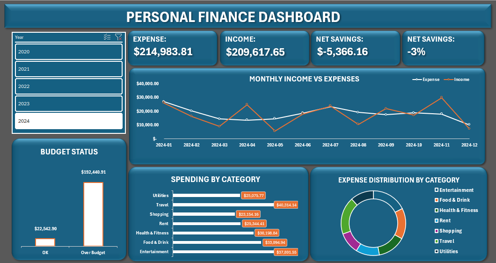

# Personal Finance Dashboard — Excel

An interactive personal finance dashboard built in Excel using a 1,500-row Kaggle dataset.

## Files
- `Personal_Finance_Dataset_Project.xlsx` — full workbook with raw data, cleaned data, pivot tables, and dashboard
- `Excel-Dashboard.png` — dashboard screenshot

## Dataset
**Source:** [Personal Finance Data — Kaggle](https://www.kaggle.com/datasets/ramyapintchy/personal-finance-data)

- 1,500 transactions across 2020–2024
- Categories: Entertainment, Food & Drink, Health & Fitness, Investment, Rent, Salary, Shopping, Travel, Utilities

## What I Did
- Cleaned data using Power Query — fixed date formats, filtered nulls, corrected Income/Expense labels
- Added calculated columns using XLOOKUP, SUMIF, and IF formulas
- Built KPI cards, PivotCharts, and a Year slicer in an interactive dashboard

## Key Insights
- Expenses exceeded income across all 5 years — **-22% savings rate**
- Travel was the highest spending category (~$169,497 total)
- Over-budget transactions accounted for the majority of total spending

## Skills Used
Power Query · XLOOKUP · SUMIF · Pivot Tables · PivotCharts · Dashboard Design · Slicers
