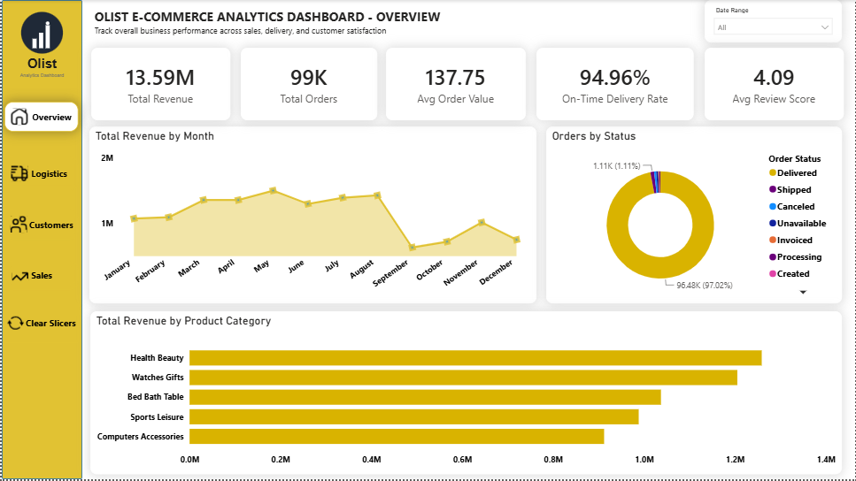
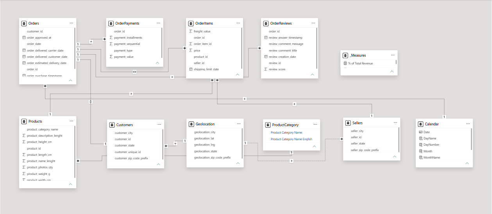
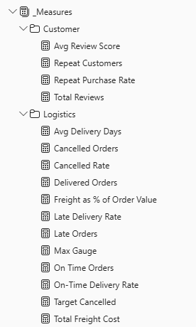
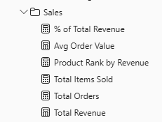
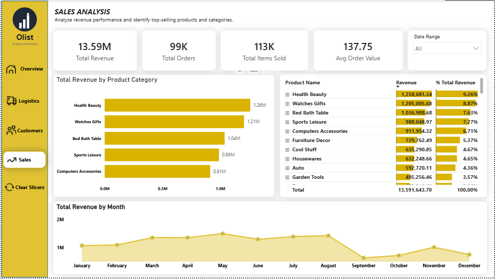
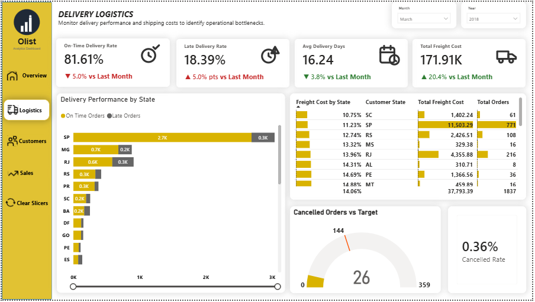
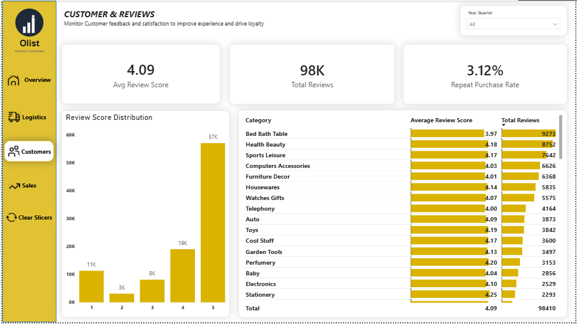

# Olist E-Commerce Analytics Dashboard

A Power BI project built on the real Olist Brazilian e-commerce dataset — from nine raw CSVs to a working data model and a four-page interactive dashboard.



📁 **[Download the .pbix file](https://drive.google.com/file/d/1X94o5F5H_EYCXwcdtVMtHVfJEPCGzg13/view?usp=sharing)** — too large for GitHub, hosted externally.

---

## Project Overview

Olist, a Brazilian multi-category e-commerce marketplace. 

**KPIs covered:** Revenue and order volume, delivery performance (on-time vs. late), review scores, seller performance, payment behavior, freight cost, repeat purchase rate.

**Known limitations of the dataset:**
- No "Returns" concept — Olist doesn't track product returns.
- No product cost/COGS — only revenue and freight can be calculated, not true profit.

---

## 1. Source Data

Nine CSVs, loaded individually via Get Data → Text/CSV, organized into Power Query folders (Facts / Dimensions):

| Table | Type | Grain |
|---|---|---|
| Orders | Fact | 1 row per order |
| OrderItems | Fact | 1 row per item/unit sold |
| OrderPayments | Fact | 1 row per payment installment |
| OrderReviews | Fact | 1 row per review |
| Customers | Dimension | 1 row per customer_id (per-order, not per-person) |
| Products | Dimension | 1 row per product_id |
| Sellers | Dimension | 1 row per seller |
| Geolocation | Dimension | Aggregated to 1 row per zip prefix |
| ProductCategory | Lookup | Portuguese → English category translation |

---

## 2. Data Cleaning

- **Orders:** null delivery dates left intentionally blank — they indicate the order was never delivered, which is signal, not dirty data.
- **Products:** ~610 rows had null category/description fields. Confirmed no duplicate `product_id`s via Group By, so nulls were unrecoverable. Replaced category nulls with `"unknown"`, numeric nulls with `0`. Rows kept, not deleted, since they're referenced in real sales.
- **Customers:** `customer_id` is unique per order, not per person — `customer_unique_id` is the true person-level key. Used for all repeat-purchase logic.
- **Geolocation:** original table had many rows per zip prefix. Grouped by zip, averaging lat/lng and taking Min for city/state, to prevent fan-out when related to Customers/Sellers.
- **OrderReviews:** duplicate `review_id`s found and removed.
- **OrderPayments:** verified no null/zero installment values.

---

## 3. Data Model

Star schema: 4 fact tables, 5 dimension tables, 1 Calendar table.



**Notable relationship decisions:**
- Customers → Geolocation kept active; Sellers → Geolocation set inactive (ambiguous path otherwise), activated via `USERELATIONSHIP()` when needed.
- OrderItems → Orders relationship set to bidirectional filtering, required for category-level filters to reach Orders and OrderReviews correctly.

**Calendar table:** built by anchoring to a clean `DATEVALUE()` column in Orders (`order_purchase_timestamp` was a full datetime, which didn't match a date-only Calendar table on relationship). Marked as the official Date Table.

---

## 4. DAX Measures




22 measures total, organized into three display folders.

### Customer
```dax
Avg Review Score = AVERAGE(OrderReviews[review_score])

Total Reviews = COUNTROWS(OrderReviews)

Repeat Customers = 
CALCULATE(
    DISTINCTCOUNT(Customers[customer_unique_id]),
    FILTER(
        VALUES(Customers[customer_unique_id]),
        CALCULATE(DISTINCTCOUNT(Orders[order_id])) > 1
    )
)

Repeat Purchase Rate = 
DIVIDE([Repeat Customers], DISTINCTCOUNT(Customers[customer_unique_id]))
```

### Logistics
```dax
Total Freight Cost = SUM(OrderItems[freight_value])

Freight as % of Order Value = DIVIDE([Total Freight Cost], [Total Revenue])

Avg Delivery Days = AVERAGEX(
    FILTER(Orders, NOT(ISBLANK(Orders[order_delivered_customer_date]))),
    DATEDIFF(Orders[order_purchase_timestamp], Orders[order_delivered_customer_date], DAY)
)

On Time Orders = CALCULATE(
    COUNTROWS(Orders),
    Orders[order_delivered_customer_date] <= Orders[order_estimated_delivery_date]
)

Late Orders = CALCULATE(
    COUNTROWS(Orders),
    Orders[order_delivered_customer_date] > Orders[order_estimated_delivery_date]
)

On-Time Delivery Rate = DIVIDE(
    CALCULATE(COUNTROWS(Orders), Orders[order_delivered_customer_date] <= Orders[order_estimated_delivery_date]),
    CALCULATE(COUNTROWS(Orders), Orders[order_status] = "Delivered")
)

Late Delivery Rate = 1 - [On-Time Delivery Rate]

Delivered Orders = CALCULATE(
    COUNTROWS(Orders),
    Orders[order_status] = "Delivered"
)

Cancelled Orders = CALCULATE(COUNTROWS(Orders), Orders[order_status] = "Canceled")

Cancelled Rate = DIVIDE([Cancelled Orders], [Total Orders])

Max Gauge = [Total Orders] * 0.05

Target Cancelled = [Total Orders] * 0.02
```

### Sales
```dax
Total Revenue = SUM(OrderItems[price])

Total Orders = DISTINCTCOUNT(OrderItems[order_id])

Total Items Sold = COUNTROWS(OrderItems)

Avg Order Value = DIVIDE(_Measures[Total Revenue], _Measures[Total Orders])

Product Rank by Revenue = 
IF(
    ISINSCOPE(Products[product_id]),
    RANKX(ALL(Products[product_id]), [Total Revenue], , DESC),
    BLANK()
)

% of Total Revenue = 
DIVIDE(
    [Total Revenue],
    CALCULATE([Total Revenue], ALL(Products))
)
```

**Verified values:**
- Total Revenue: 13.59M
- Total Orders: 99K
- On-Time Delivery Rate: 95%
- Avg Review Score: 4.09

---

## 5. Report Pages

Four pages, built with a shared sidebar navigation.

### Business Overview
KPI cards, revenue trend, order status breakdown, top categories.


### Sales Analysis
Revenue by category, drill-down product leaderboard ranked by revenue, monthly trend.



### Delivery Logistics
On-time vs. late delivery by state, freight cost as % of order value, cancelled orders gauge benchmarked against a dynamic target.



### Customer & Reviews
Review score distribution, average score by product category.



---

## 6. Notable Issues Solved

| Issue | Root Cause | Fix |
|---|---|---|
| Chart showing identical values across every category | Inactive/one-way relationship blocking filter propagation | Set OrderItems → Orders relationship to bidirectional |
| Calendar chart showing near-zero matches | Date-only Calendar column vs. full datetime Orders column | Added `DATEVALUE()` column, related on that instead |
| RANKX showing "1" for every row in a matrix | Measure grain mismatch after adding a category grouping level | Wrapped in `ISINSCOPE()` to only rank at product-level |
| Donut chart order count didn't match KPI card | Field pulled from OrderItems (fewer rows) instead of Orders | Switched Value field to `Orders[order_id]` |

---

## 7. Open Items / Next Steps

- One-day revenue spike around March 4, 2017 (~12,658.51) — flagged for further investigation.
- Deprioritized for a future iteration: time intelligence (YoY, rolling averages), dynamic KPI selector, Power Apps/Automate integration.

## 8. Tools Used

Power BI Desktop — Power Query, DAX, Data Modeling, Report Design.